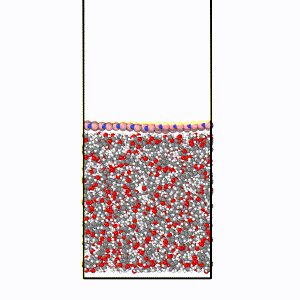

# thang_tool

This section contains the docs for several in-house codes to handle some specific tasks.

Some of them are encapsulated into the `thatool` package.

```python
pip install -e .
```


<!--  -->



 

```
thatool
    │   data.py  
    │
    └───filetool
    │   │   define_script.py
    |   |   LmpFrame.py
    │   │   ...
    │   
    └───free_energy_cal
    │   │   Helmholtz_excess_UF.py
    │   |   replica_logPD_intergration.py
    │   │   ...
    └───modeling
    │   │   box_orientation.py
    │   |   crystal3D.py
    │   │   ...
    └───utils
    │   │   coord_rotation.py
    │   |   unit_convert.py
    │   │   ...
    |   
``` 
