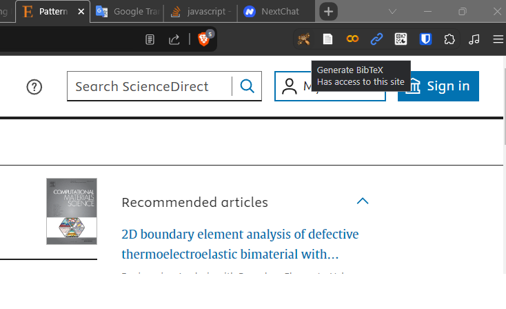

# BibTeX generator

Have you ever found yourself weary and uninspired from the tedious task of manually creating BibTeX entries for your paper?

There are, indeed, support tools and plugins that are bundled with reference managers such as Zotero, Mendeley, etc. These tools can automate the generation of a `.bib` file. To use them, you need to install a reference manager, its associated plugins, and a library of papers on your computer. However, these tools aren't perfect. The BibTeX entries they generate often contain incomplete information, are poorly formatted, and include numerous unnecessary fields. You then still need to manually check and correct the entries.

There are times you just need to cite a paper or two, and you don't want to go through the hassle of the aforementioned process. Facing this situation quite often, I just want to quickly copy and paste a bib entry to the `.bib` file and that's it. Think of such a simple tool, I have looked around the Chrome extension store to see if there is any that can pick up the Bibtex while you are browsing the paper. I found some, but they do not really work.

Therefore, I decided to create a simple tool to help me with that. It took me a few nights to write a Chrome extension that can generate a BibTeX entry for any browsing URL with just one click. I named it the [BibTeX generator](./). It works exactly what I needed. I finally found something helpful.

## Usage
Install the [BibTeX generator](./) extension on your Chrome browser. Then, whenever you're browsing a paper or any URL, just click on the extension icon, and the BibTeX entry will be generated and copied to your clipboard. You can just paste it to your `.bib` file.

<p align="center">

</p>

I've tested the extension on numerous publishers and websites with varying structures and it works like a charm. The tested publishers include Elsevier, Wiley, ACS, IOP, AIP, APS, arXiv,...

Here are some examples of BibTeX entries generated by the extension [BibTeX generator](./):

- Article on Elsevier: [10.1016/j.commatsci.2018.10.023](https://doi.org/10.1016/j.commatsci.2018.10.023)

```bibtex
@article{nguyen2019pattern,
    title = {Pattern transformation induced by elastic instability of metallic porous structures},
    author = {Cao Thang Nguyen and Duc Tam Ho and Seung Tae Choi and Doo-Man Chun and Sung Youb Kim },
    year = {2019},
    month = {2},
    journal = {Computational Materials Science},
    publisher = {Elsevier},
    volume = {157},
    pages = {17-24},
    doi = {10.1016/j.commatsci.2018.10.023},
    url = {https://www.sciencedirect.com/science/article/abs/pii/S0927025618306955?via%3Dihub},
    accessDate = {Jan 25, 2024}
}
```

- Article on Wiley: [10.1002/adts.202300538](https://doi.org/10.1002/adts.202300538)

```bibtex
@article{nguyen2024an,
    title = {An Enhanced Sampling Approach for Computing the Free Energy of Solid Surface and Solid–Liquid Interface},
    author = {Cao Thang Nguyen and Duc Tam Ho and Sung Youb Kim},
    year = {2024},
    month = {1},
    journal = {Advanced Theory and Simulations},
    publisher = {John Wiley & Sons, Ltd},
    volume = {7},
    number = {1},
    pages = {2300538},
    doi = {10.1002/adts.202300538},
    url = {https://onlinelibrary.wiley.com/doi/10.1002/adts.202300538},
    accessDate = {Jan 25, 2024}
}
```

- Google Book 1: [America, the Vietnam War, and the World](https://www.google.co.kr/books/edition/America_the_Vietnam_War_and_the_World/9kn6qYwsGs4C?hl=en&gbpv=0)

```bibtex
@book{daum2003america,,
    title = {America, the Vietnam War, and the World},
    author = {Andreas W. Daum and Lloyd C. Gardner and Wilfried Mausbach},
    year = {2003},
    month = {7},
    publisher = {Cambridge University Press},
    isbn = {052100876X},
    url = {https://www.google.co.kr/books/edition/America_the_Vietnam_War_and_the_World/9kn6qYwsGs4C?hl=en&gbpv=0},
    accessDate = {Jan 28, 2024}
}
```

- Google Book 2: [Currency Wars](https://books.google.co.kr/books?id=-GDwL2s5sJoC&source=gbs_book_other_versions)

```bibtex
@book{rickards2011currency,
    title = {Currency Wars},
    author = {James Rickards},
    year = {2011},
    month = {11},
    publisher = {Penguin},
    isbn = {110155889X},
    url = {https://books.google.co.kr/books?id=-GDwL2s5sJoC&source=gbs_book_other_versions},
    accessDate = {Jan 28, 2024}
}
```

- Blog post: [https://deci.ai/blog/decicoder-6b-the-best-multi-language-code-generation-llm-in-its-class/](https://deci.ai/blog/decicoder-6b-the-best-multi-language-code-generation-llm-in-its-class/)

```bibtex
@misc{deci2024introducing,
    title = {Introducing DeciCoder-6B: The Best Multi-Language Code LLM in Its Class},
    author = {Deci},
    year = {2024},
    month = {1},
    publisher = {Deci},
    url = {https://deci.ai/blog/decicoder-6b-the-best-multi-language-code-generation-llm-in-its-class/},
    accessDate = {Jan 25, 2024}
}
```

- Packages on Zenodo: [https://zenodo.org/records/7751762](https://zenodo.org/records/7751762)

```bibtex
@misc{kai2023force-field,
    title = {Force-field files for "Noble gas (He, Ne and Ar) solubilities in high-pressure silicate melts calculated based on deep potential modeling"},
    author = {Wang, Kai and Lu, Xiancai and Liu, Xiandong and Yin, Kun},
    year = {2023},
    month = {3},
    publisher = {Zenodo},
    doi = {10.5281/zenodo.7751762},
    url = {https://zenodo.org/records/7751762},
    accessDate = {Jan 25, 2024}
}
```

In summary, the new extension [BibTeX generator](./) works well for most websites with varying data structures.
