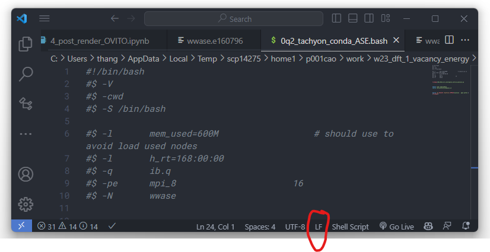

# Sun grid system


## Some errors

The error:
```
/etc/profile.d/modules.sh
: No such file or directory
```
check `End of Line Sequence` of `submit.bash` file. On the Linux system, it must be `LF` but not `CRLF`

When open in VSCode:



Setting.json (see [this link](https://medium.com/bootdotdev/how-to-get-consistent-line-breaks-in-vs-code-lf-vs-crlf-e1583bf0f0b6))

For LR:
```
{
    "files.eol": "\n",
}
```
For CRLF:
```
{
    "files.eol": "\r\n",
}
```
